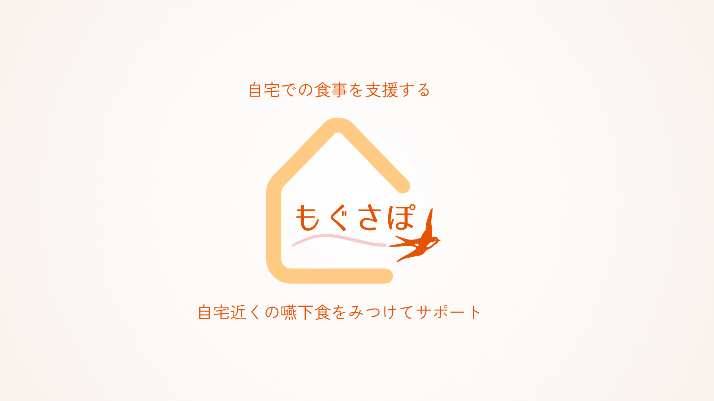
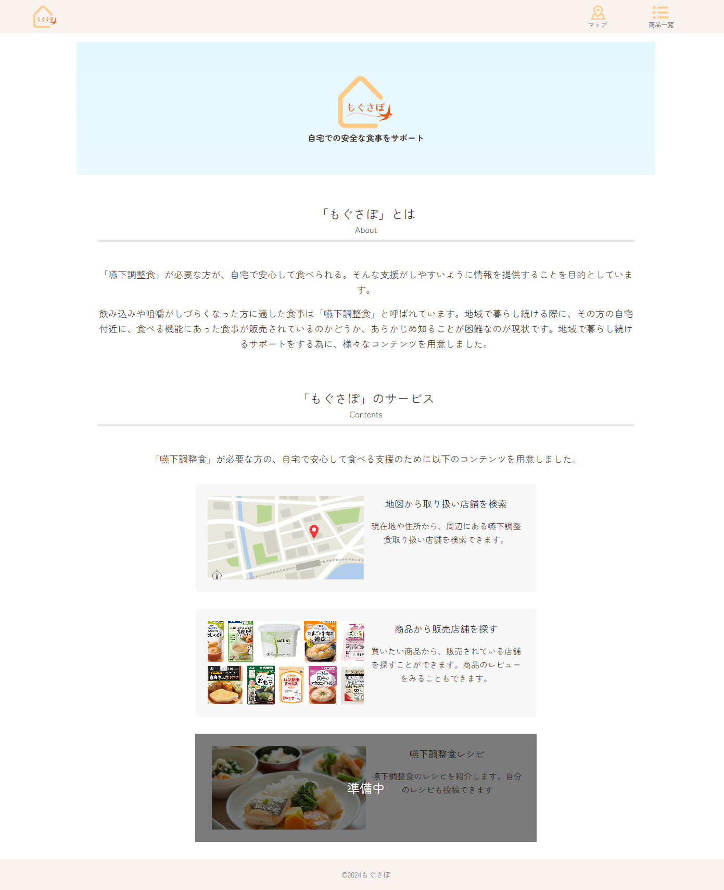
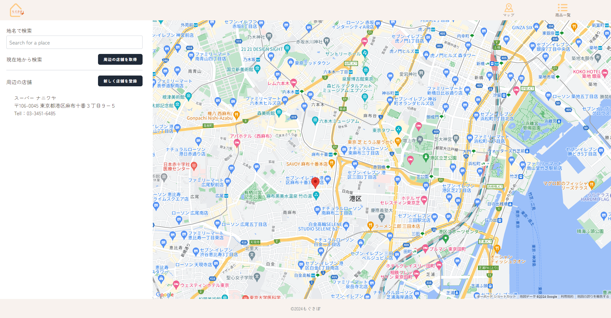
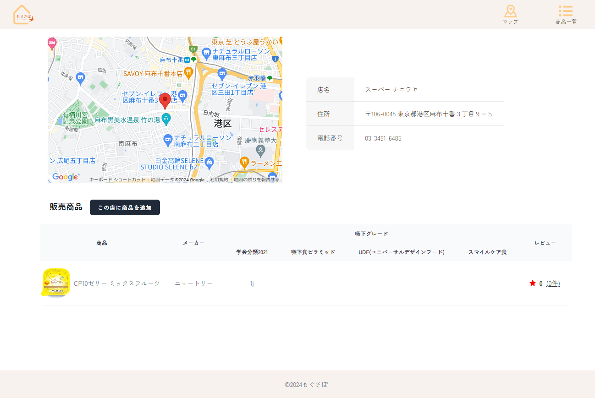
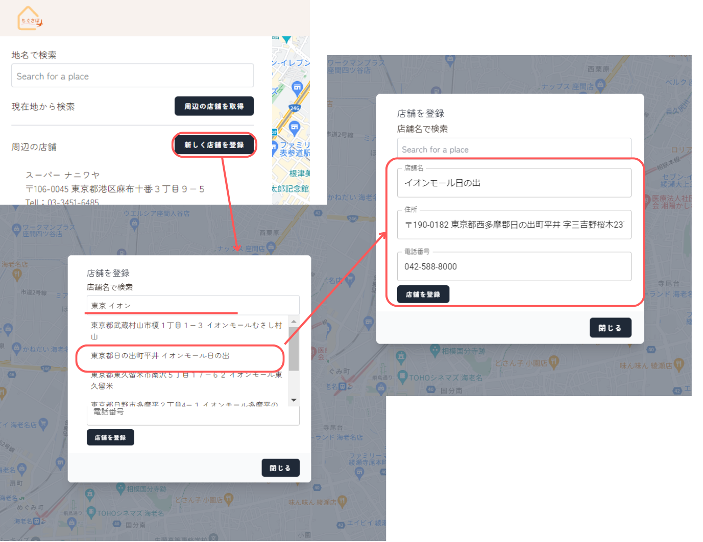
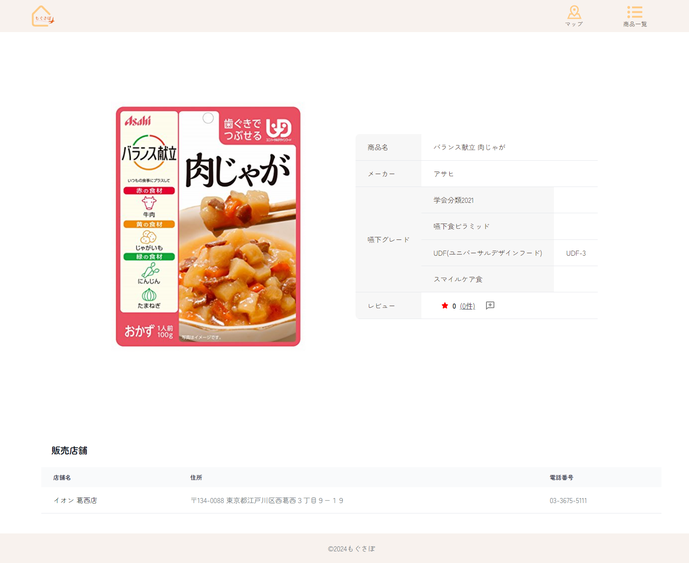
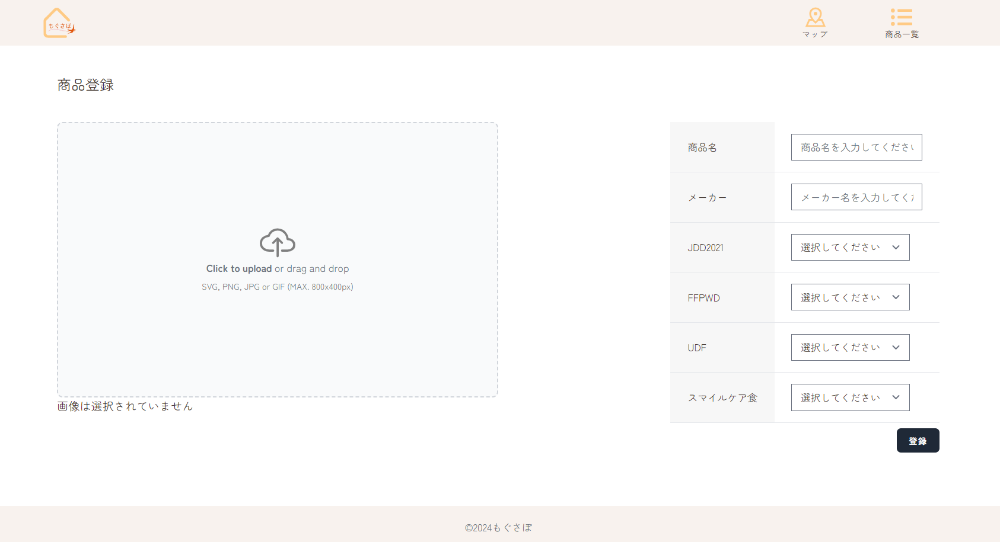

# もぐさぽ

**[自宅での安全な食事を支援する「もぐさぽ」](https://osyokuzi.com)**

## 1．サービス概要

**[テーマおよび要件定義](documents/RequirementDefinition.md)**

- **嚥下食で自宅に退院する方を支援したい医療・介護関係者**
- **嚥下食で自宅に退院した患者とその介護者**
  むけの情報取得・投稿サービス です。

患者様の自宅の近くにどんな嚥下食が販売されているか知る・自分で見つけたものを投稿することができます。

他のサービス ([嚥下食.com](https://www.engesyoku.com/)、[摂食嚥下関連医療資源マップ](https://www.swallowing.link/restaurants)、[日本誤嚥性肺炎予防協会](https://j-appa.or.jp/) )
とは違って、地図を元に具体的な販売店と取り扱い商品の情報を知ることが出来ます。また、自分自身が情報を投稿することが可能です。

## 2．使用技術

### フロントエンド

**[フロントエンド URL](https://github.com/shihoin2/Front-OriginalProduct)**

- React 18.3.1
- Next.js 14.2.4

### バックエンド

**[バックエンド URL](https://github.com/shihoin2/Back-OriginalProduct)**

- PHP 8.1
- Laravel Framework 10.10

### ライブラリ

**データフェッチ関連**

- Axios 1.7.2

**UI**

- Tailwind CSS 3.4.4
- MUI 5.15.20
- CSS Modules
- React-icons 5.2.1

**フォーム関連**

React Hook From 7.52.0

### インフラ

- Apache 2.4.57
- Vercel (フロントエンド)
- AWS (バックエンド)
  - AWS の主な利用サービス
    - EC2 (Elastic Compute Cloud)
    - Route 53
    - RDS
    - S3 (Simple Storage Service)
    - CloudFront 他..

### バージョン管理

- Git/GitHub

### その他

**Google Map API**
vis.gl/react-google-maps 0.10.0

## 3. 設計

**[設計](documents/design.md)**

## 4. 機能一覧

- 店舗検索
- 店舗登録
- 商品検索
- 商品登録
- 商品レビュー確認
- 商品レビュー登録

| トップページ                                                                                                                 | マップページ                                                                                                                                                                                                                             |
| ---------------------------------------------------------------------------------------------------------------------------- | ---------------------------------------------------------------------------------------------------------------------------------------------------------------------------------------------------------------------------------------- |
|                                                                |                                                                                                                                                                            |
| サービス概要の説明を見ることができます。「店舗検索」「商品確認」「レシピ(今後作成予定)」にアクセスできるようになっています。 | 地図上で嚥下調整食や介護食を販売している店舗を検索できる様になっています。検索方法としては以下 2 通りがが可能です ・ 現在地から周辺の店舗を検索 ・ 地名を入力して周辺の販売店検索  また、地図から店舗登録をすることが可能です。 |

| 店舗情報確認                                                                                                 | 店舗情報登録                                                                                                                       |
| ------------------------------------------------------------------------------------------------------------ | ---------------------------------------------------------------------------------------------------------------------------------- |
|                                                    |                                                                    |
| 販売店舗の情報を確認することができます。「販売店の所在地」「何が販売されているか」を確認することができます。 | 地図画面からアクセスが可能です。検索バーで検索すると、候補地が表示されます。選択すると自動で店舗名や電話番号、住所が入力されます。 |

| 商品情報確認                                                                                                                                                                     | 商品情報登録                                                                               |
| -------------------------------------------------------------------------------------------------------------------------------------------------------------------------------- | ------------------------------------------------------------------------------------------ |
|                                                                                                                    |                            |
| 登録されている商品の情報を確認することができます。商品名などの基本的な情報や、嚥下調整食の分類、販売店舗を確認することができます。ここから商品のレビューを確認、登録ができます。 | 商品の画像、名前、嚥下調整食の分類を登録できます。画像はリアルタイムで画面に表示されます。 |

| レビュー確認                                                                                                                                                                          | レビュー登録                                                                                                                                                    |
| ------------------------------------------------------------------------------------------------------------------------------------------------------------------------------------- | --------------------------------------------------------------------------------------------------------------------------------------------------------------- |
| 店舗情報や商品情報からモーダルが表示され、商品のレビューを確認することができます。「登録したユーザー名」「登録日時」「評価(星 5 個中いくつか)」「レビュー詳細」を見ることができます。 | 商品情報画面の登録アイコンをクリックするとモーダルが表示され、商品のレビューを登録することができます。評価数は星 5 個中いくつかと、詳細なレビューを登録します。 |
