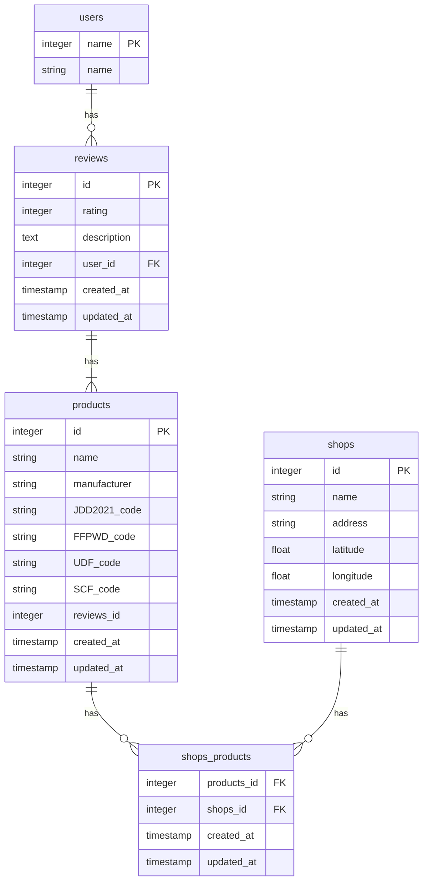
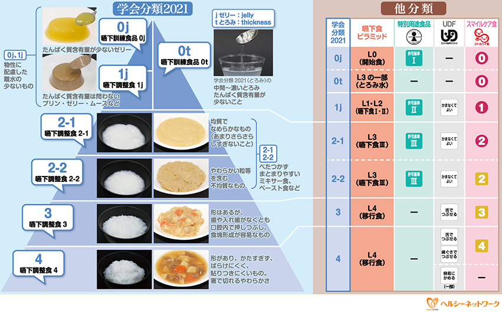
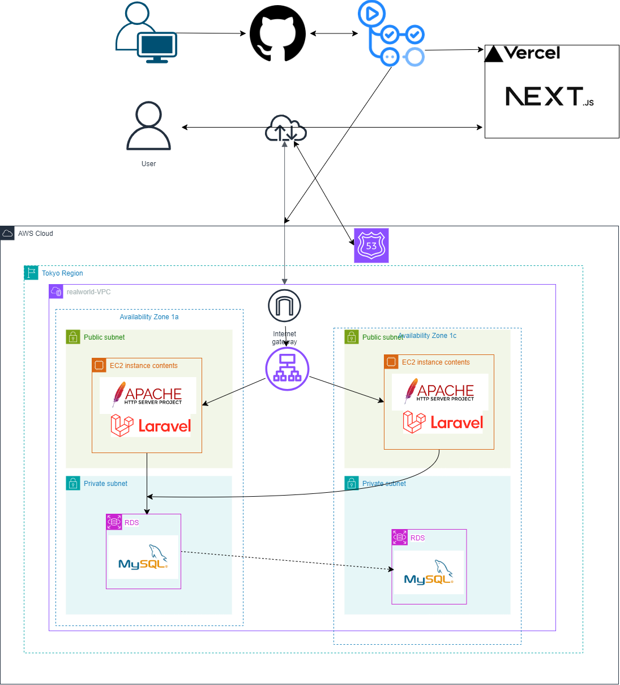

# 設計

オリジナルプロダクトの設計を行います。

## ステップ2

設計について、以下を作成してください。

### 1. 業務フロー
[業務フロー](https://www.figma.com/file/DATInSUXKXQQvGPjbwZ5Fr/%E6%A5%AD%E5%8B%99%E3%83%95%E3%83%AD%E3%83%BC?type=whiteboard&node-id=0-1&t=lG7CwtbMMtjQkLH9-0)

### 2. 画面遷移図
### 3. ワイヤーフレーム
[画面遷移](https://www.figma.com/file/bxiuZPUgXqpd9bM4rgB5Iv/%E7%94%BB%E9%9D%A2%E9%81%B7%E7%A7%BB%E5%9B%B3?type=design&node-id=0-1&mode=design&t=bwZnXBcBpYaWrJSc-0)

### 4. テーブル定義書（もしくは ER 図）
#### ER図

PlantUML

#### テーブル定義書
##### usersテーブル
ユーザーを管理するテーブル。Google認証をする予定なので、パスワード等は保持しない

| Field  | Type | Null | Key | Default | Extra |
| --- | --- | --- | --- | --- | --- |
| id | bigint unsigned | No | PRI |  | auto_increment |
| name | string(100) | No |  |  |  |
| created_at | timestamp | No |  |  |  |
| updated_at | timestamp | No |  |  |  |

##### productsテーブル
地図上の店舗に販売されている商品の詳細情報。
* name：商品名
* manufacture：製造元
* reviews_id：商品に対するレビュー
* JDD2021_code～SCF_code：商品がどの嚥下グレードに分類されているかコード内容は以下画像を参照
    
    テーブルでは下記のように省略
    * <a id = "JDD2021">JDD2021：日本摂食嚥下リハビリテーション学会嚥下調整食分類2021</a>
    * <a id = "FFPWD">FFPWD：嚥下困難者用食品</a>
    * <a id = "UDF">UDF：ユニバーサルデザインフード</a>
    * <a id = "SCF">SCF：スマイルケア食</a>

| Field  | Type | Null | Key | Default | Extra |
| --- | --- | --- | --- | --- | --- |
| id | bigint unsigned | No | PRI |  | auto_increment |
| name | string(200) | No |  |  |  |
| manufacture | string(100) | No |  |  |  |
| [JDD2021_code](#JDD2021) | string(20) | YES | FK | NULL |  |
| [FFPWD_code](#FFPWD) | string(20) | YES | FK | NULL |  |
| [UDF_code](#UDF) | string(20) | YES | FK | NULL |  |
| [SCF_code](#SCF) | string(20) | YES | FK | NULL |  |
| reviews_id | bigint unsigned | YES | FK | NULL |  |
| created_at | timestamp | No |  |  |  |
| updated_at | timestamp | No |  |  |  |

ボツproductsテーブル

嚥下食の分類コードは別テーブルで管理するのではなく、直接入力することにする

| Field  | Type | Null | Key | Default | Extra |
| --- | --- | --- | --- | --- | --- |
| id | bigint unsigned | No | PRI |  | auto_increment |
| name | string | No |  |  |  |
| manufacture | string | No |  |  |  |
| JDD2021_id | bigint unsigned | YES | FK | NULL |  |
| FFPWD_id | bigint unsigned | YES | FK | NULL |  |
| UDF_id | bigint unsigned | YES | FK | NULL |  |
| SCF_id | bigint unsigned | YES | FK | NULL |  |
| reviews_id | bigint unsigned | YES | FK | NULL |  |

##### reviewsテーブル
商品に対するレビューを管理するテーブル。
* rating：1～5の数字。実装時はraring barで表示できるようにする
* description：レビューの内容
* user_id：投稿したユーザーのID。

| Field  | Type | Null | Key | Default | Extra |
| --- | --- | --- | --- | --- | --- |
| id | bigint unsigned | No | PRI |  | auto_increment |
| rating | integer(1～5) | No |  |  |  |
| description | text | No |  |  |  |
| user_id | bigint unsigned | No | FK |  |  |
| created_at | timestamp | No |  |  |  |
| updated_at | timestamp | No |  |  |  |

##### shopsテーブル
マップ上に表示する店舗の情報。
* name：店舗名
* address：店舗の住所

※以下2つの情報をもとにマップにピンを表示させる
* latitude：緯度
* longitude：経度

| Field  | Type | Null | Key | Default | Extra |
| --- | --- | --- | --- | --- | --- |
| id | bigint unsigned | No | PRI |  | auto_increment |
| name | string(200) | No |  |  |  |
| address | string(255) | No |  |  |  |
| latitude | float | No |  |  |  |
| longitude | float | No |  |  |  |
| created_at | timestamp | No |  |  |  |
| updated_at | timestamp | No |  |  |  |

##### shops_productsテーブル
多対多になるshopsテーブルとproductsテーブルの中間テーブルとして使用
| Field  | Type | Null | Key | Default | Extra |
| --- | --- | --- | --- | --- | --- |
| products_id | bigint unsigned | No | FK |  |  |
| shops_id | bigint unsigned | No | FK |  |  |
| created_at | timestamp | No |  |  |  |
| updated_at | timestamp | No |  |  |  |

ボツ嚥下食コード各種テーブル

**※以下のテーブルのレコードはあらかじめ開発者側で準備しておく。**
**販売している嚥下食の分類一覧→商品詳細に表示する**
→商品を新規に登録する際に必要かと思ったが、あらかじめリストにしておけば必要ないかも

##### JDD2021(日本摂食嚥下リハビリテーション学会嚥下調整食分類2021のグレード)テーブル

| Field  | Type | Null | Key | Default | Extra |
| --- | --- | --- | --- | --- | --- |
| id | bigint unsigned | No | PRI |  | auto_increment |
| code | string | No |  |  |  |

##### FFPWD(嚥下困難者用食品のグレード)テーブル

| Field  | Type | Null | Key | Default | Extra |
| --- | --- | --- | --- | --- | --- |
| id | bigint unsigned | No | PRI |  | auto_increment |
| code | string | No |  |　 |  |

##### UDF(ユニバーサルデザインフードのグレード)テーブル

| Field  | Type | Null | Key | Default | Extra |
| --- | --- | --- | --- | --- | --- |
| id | bigint unsigned | No | PRI |  | auto_increment |
| code | string | No |  |  |  |

##### SCF(スマイルケア食のグレード)テーブル

| Field  | Type | Null | Key | Default | Extra |
| --- | --- | --- | --- | --- | --- |
| id | bigint unsigned | No | PRI |  | auto_increment |
| code | string | No |  |  |  |

### 5. システム構成図

